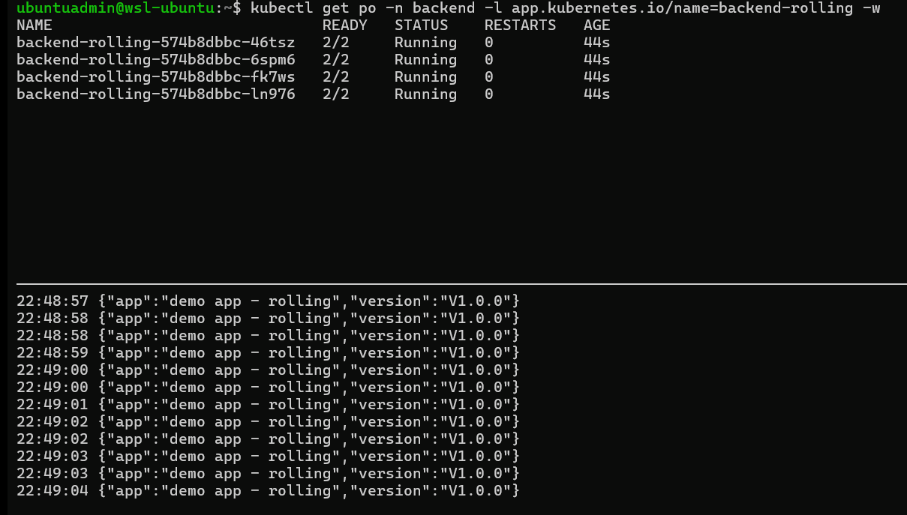
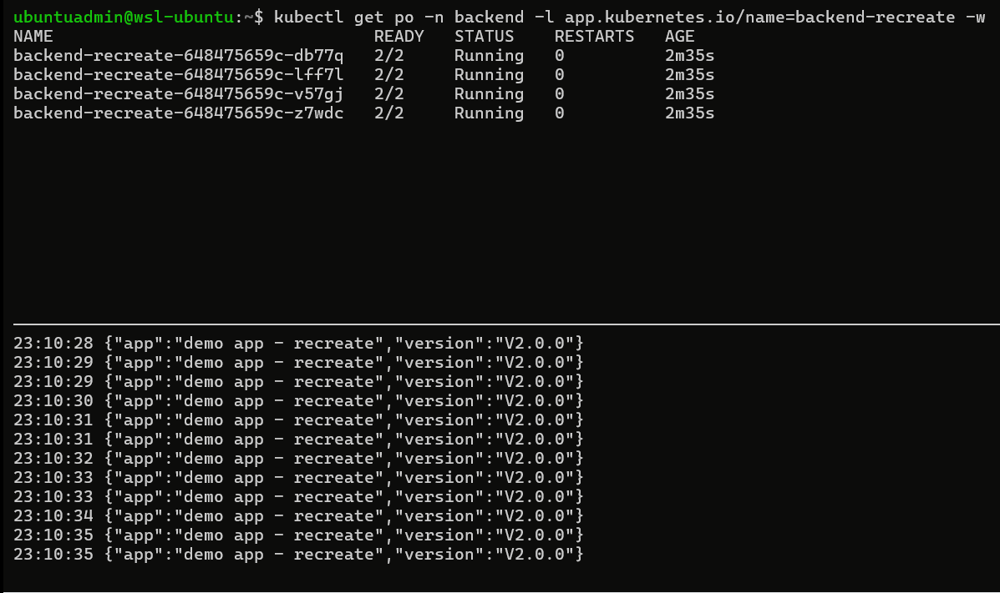

# Kubernetes Deployment Playbook

> One web app. Six strategies. Real-world settings.

A cloud-native project that demonstrates six mainstream Kubernetes deployment strategies on a single AKS cluster.

        

- [Kubernetes Deployment Playbook](#kubernetes-deployment-playbook)
  - [Challenge](#challenge)
  - [Architecture](#architecture)
  - [Deployment Strategies](#deployment-strategies)
    - [Rolling Update](#rolling-update)
    - [Recreate](#recreate)
    - [Canary](#canary)
    - [Blue-Green](#blue-green)
    - [A/B Testing](#ab-testing)
    - [Shadow Deployment](#shadow-deployment)
  - [Strategies Decision](#strategies-decision)
  - [Documentation](#documentation)

---

## Challenge

Deployment is a critical process: it makes an application available in a live environment and delivers business value.

> How do team select the right deployment method for a given requirement?

- This project
  - creates and deploys a **simple web application** in a real-world environment (Cluster + TLS + DNS),
  - compares **six common deployment methods**,
  - and concludes a **deployment decistion strategy**.

---

## Architecture

```
recreate
rolling
canary
blue-green
a/b test
shadow
```

---

## Deployment Strategies

### Rolling Update

- `Rolling Update`
  - Definition: Gradually replaces old pods with new ones, using `maxSurge` and `maxUnavailable` so the service stays available throughout.
  - Tools: Kubernetes (native `Deployment` strategy)
  - Pros:
    - Zero downtime when readiness probes are configured correctly.
    - Built into Kubernetes: no additional controllers required.
  - Cons:
    - Old and new versions run simultaneously, so the app must be backward-compatible.
    - Rollback is another rolling update, not an instant switch.

- **ArgoCD UI**:


> gradually replaces older versions of an application new ones

- curl command to confirm downtime



> zero downtime from V1.0.0 to V1.1.0

---

### Recreate

- `Recreate`
  - Definition: Terminates all existing pods before starting the new version, resulting in a brief service outage during the switch.
  - Tools: Kubernetes (native `Deployment` strategy)
  - Pros:
    - Simplest possible rollout: no version overlap to reason about.
    - Guarantees a clean cutover for workloads that cannot tolerate concurrent versions.
  - Cons:
    - Incurs downtime between the shutdown and readiness of the new pods.
    - Not suitable for user-facing production services with availability SLAs.

- **ArgoCD UI**:


> Terminates all existing pods before starting the new version

- curl command to confirm downtime



> experience downtime from V2.0.0 to V2.1.0: "no healthy upstream"

---

### Canary

- `Canary Deployment`
  - Definition: Progressively shifts a small percentage of live traffic to the new version, increasing the weight in stages while monitoring health before promoting to 100%.
  - Tools: Argo Rollouts + Istio (weighted `VirtualService`)
  - Benefits:
    - Limits blast radius by exposing only a subset of users to the new version.
    - Enables data-driven promotion via automated analysis of real production metrics.
    - Rollback is fast — shift the weight back to the stable version.
  - Limitations:
    - Requires reliable metrics and analysis rules to be truly automated; otherwise it becomes manual.
    - Both versions must coexist safely, including shared state and downstream contracts.

- **Argo Rollouts UI**:


- Traffic splitting


---

### Blue-Green

- `Blue-Green Deployment`
  - Definition: Runs two identical environments — blue (current) and green (new) — and cuts all traffic over at once after the green environment passes validation.
  - Tools: Argo Rollouts + Istio (active/preview services)
  - Benefits:
    - Instant cutover and equally instant rollback by flipping the router back to blue.
    - The new version can be fully validated on the preview lane before any user sees it.
    - No version mixing at the traffic layer — cleaner for stateful or contract-sensitive services.
  - Limitations:
    - Roughly doubles compute cost during the overlap window.
    - Database and schema changes still need to be backward-compatible across both lanes.


- Traffic splitting


---

### A/B Testing

- `A/B Testing`
  - Definition: Routes specific user segments to different versions based on request attributes (headers, cookies, geography) rather than random weights, so behavior can be compared under matched conditions.
  - Tools: Argo Rollouts + Istio (header-matched `VirtualService`)
  - Use cases:
    - Feature experimentation — measure conversion or engagement between variants.
    - Targeted rollout to beta users, internal testers, or a specific region.
    - Comparing UX or algorithm changes with statistically meaningful cohorts.


- Traffic splitting


---

### Shadow Deployment

- `Shadow (Traffic Mirroring)`
  - Definition: Mirrors a copy of live production traffic to the new version while responses are discarded, so the candidate is exercised with real workload without affecting users.
  - Tools: Argo Rollouts + Istio (`mirror` and `mirrorPercentage` on `VirtualService`)
  - Use cases:
    - Performance and load testing under real production traffic patterns.
    - Validating a rewritten or refactored service against the incumbent for behavioral parity.
    - Safely exercising risky changes (new database driver, dependency upgrade) with zero user impact.


- Traffic splitting


---

## Strategies Decision

The decision tree this repo follows:

```txt
Does the workload require zero concurrent versions?
├── Yes → Recreate. Accept downtime.
└── No → Do you need pod-lifecycle only, or traffic control?
    ├── Pod-lifecycle only → RollingUpdate.
    └── Traffic control → Argo Rollouts:
        ├── Instant rollback matters most        → Blue-Green
        ├── Progressive real-user exposure       → Canary
        ├── Compare versions at parity           → A/B (header + weight)
        └── Validate without exposing users      → Shadow (mirror)
```

---

## Documentation

- [Web Application with Helm](docs/01-app.md)
- [Infrastructure as Code via Terraform](docs/02-infra.md)
- [ArgoCD](docs/03-argocd.md): add sync; terraform; 
- [Network Layer by Istio](docs/04-istio.md)
