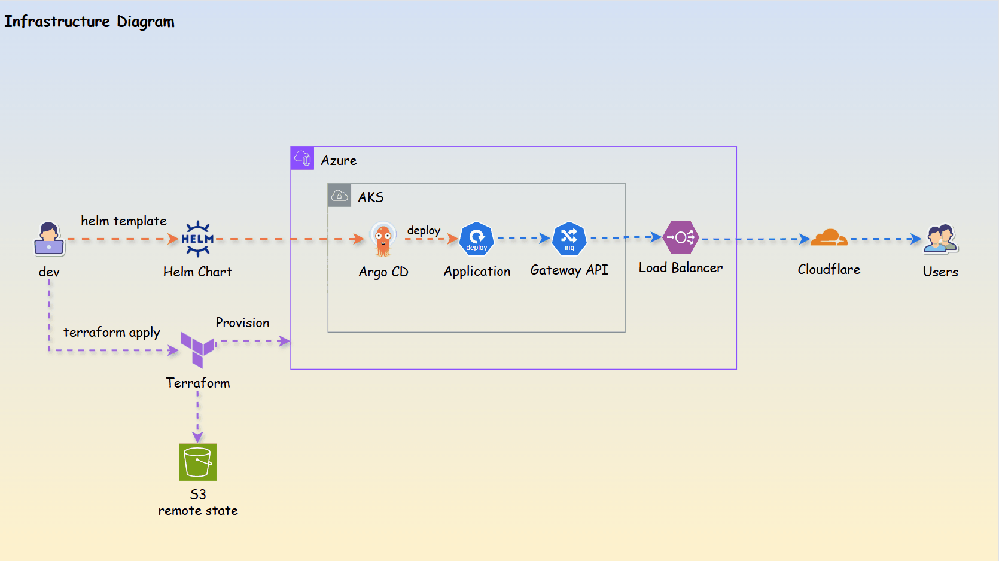
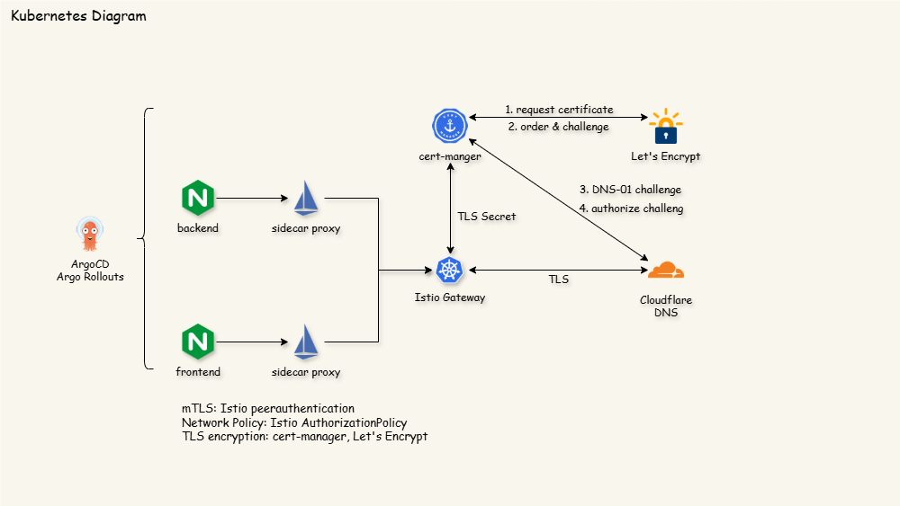
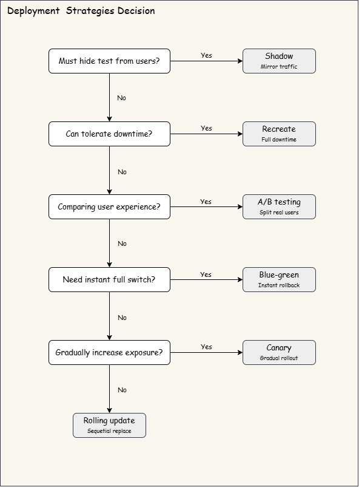
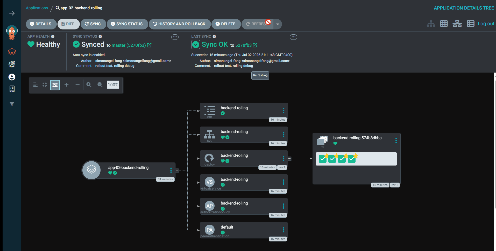
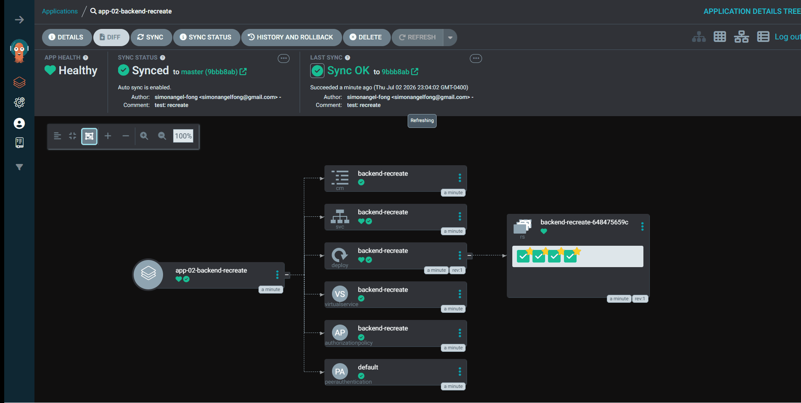
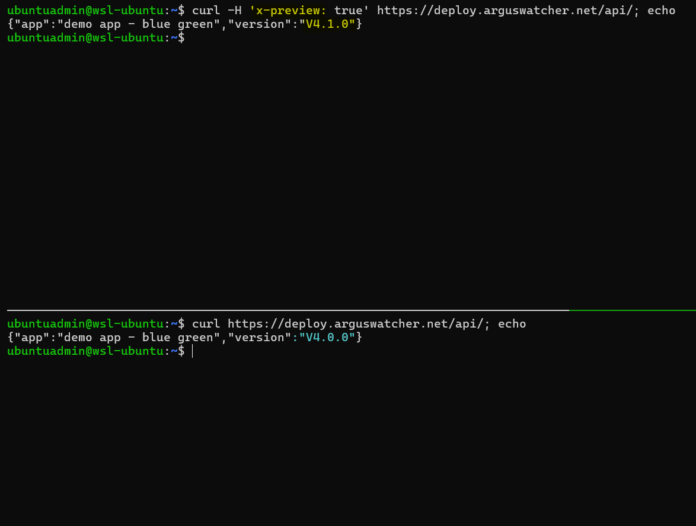
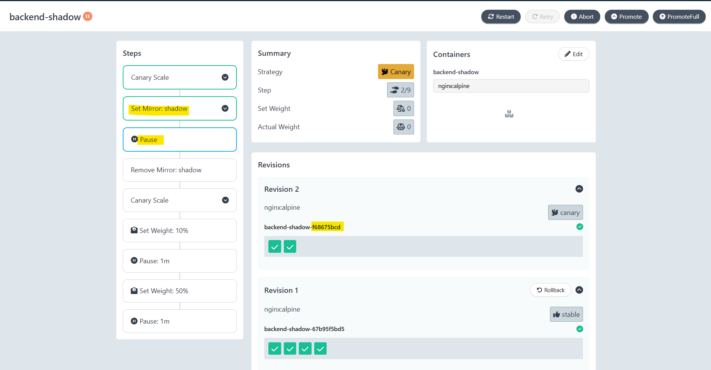

# Kubernetes Deployment Playbook

> One web app. Six strategies. Real-world settings.

A cloud-native project that demonstrates six mainstream Kubernetes deployment strategies on a single AKS cluster.

        

- [Kubernetes Deployment Playbook](#kubernetes-deployment-playbook)
  - [Challenge](#challenge)
  - [Architecture](#architecture)
  - [Strategies Decision](#strategies-decision)
  - [Deployment Strategies](#deployment-strategies)
    - [Rolling Update](#rolling-update)
    - [Recreate](#recreate)
    - [Canary](#canary)
    - [Blue-Green](#blue-green)
    - [A/B Testing](#ab-testing)
    - [Shadow Deployment](#shadow-deployment)
  - [Documentation](#documentation)

---

## Challenge

Deployment is a critical process: it makes an application available in a live environment and delivers business value.

> How does a team select the right deployment method for a given requirement?

- This project
  - creates and deploys a **simple web application** in a real-world environment (Cluster + TLS + DNS),
  - compares **six common deployment methods**,
  - and concludes with a **deployment decision strategy**.

---

## Architecture

---

## Strategies Decision

---

## Deployment Strategies

### Rolling Update

- `Rolling Update`: Incrementally replaces old pods with new ones via `maxSurge` and `maxUnavailable`, keeping the service available throughout the rollout.
- **Pros**:
  - Zero downtime when readiness probes are configured correctly.
  - Native to Kubernetes — no additional controllers required.
  - Resource-efficient: no duplicate environment required.
- **Cons**:
  - Old and new versions coexist during rollout, so the app must be backward-compatible.
  - Rollback is another rolling update, not an instant switch.
- **Common use cases**:
  - Default choice for stateless services requiring continuous availability.
  - Routine, low-risk version upgrades in production.

- **ArgoCD UI**:

> Gradually replaces older versions of an application with new ones.

- `curl` command to confirm downtime

> Zero downtime from V1.0.0 to V1.1.0.

---

### Recreate

- `Recreate`: Terminates all existing pods before starting the new version, producing a brief service outage during the switch.
- **Pros**:
  - Simplest possible rollout — no version overlap to reason about.
  - Guarantees a clean cutover for workloads that cannot tolerate concurrent versions.
  - No extra compute overhead during the transition.
- **Cons**:
  - Incurs downtime between old-pod shutdown and new-pod readiness.
  - Unsuitable for user-facing services with availability SLAs.
- **Common use cases**:
  - Batch jobs, internal tools, or dev environments where downtime is acceptable.
  - Applications with breaking schema or protocol changes that forbid version overlap.

- **ArgoCD UI**:

> Terminates all existing pods before starting the new version.

- `curl` command to confirm downtime

> Experiences downtime from V2.0.0 to V2.1.0: "no healthy upstream".

---

### Canary

- `Canary Deployment`: Progressively shifts a small percentage of live traffic to the new version, increasing the weight in stages while monitoring health before full promotion.
- **Pros**:
  - Limits blast radius by exposing only a subset of users to the new version.
  - Enables data-driven promotion via automated analysis of real production metrics.
  - Fast rollback by shifting traffic weight back to the stable version.
- **Cons**:
  - Requires reliable metrics and analysis rules; otherwise promotion becomes manual.
  - Both versions must coexist safely, including shared state and downstream contracts.
- **Common use cases**:
  - High-risk releases where gradual, monitored exposure is required.
  - Services with strong observability and automated rollback criteria.

- **Argo Rollouts UI**:

> Rollout controlled by setting weight.

- Traffic splitting

> Traffic splits from 25% to 50% to 100%.

---

### Blue-Green

- `Blue-Green Deployment`: Runs two identical environments — blue (current) and green (new) — and cuts all traffic over at once after the green environment passes validation.
- **Pros**:
  - Instant cutover and equally instant rollback by flipping the router back to blue.
  - The new version can be fully validated on the preview lane before any user sees it.
  - No version mixing at the traffic layer — cleaner for stateful or contract-sensitive services.
- **Cons**:
  - Roughly doubles compute cost during the overlap window.
  - Database and schema changes still need to be backward-compatible across both lanes.

- **Argo Rollouts UI**:

> 1. Manual promotion;
> 2. Traffic flip;
> 3. Old version auto-removed.

- Preview vs Active

> Upper: header-based request gets the preview version.
> Lower: active request gets the stable version.

> The moment traffic flips, from V4.0.0 to V4.1.0.

---

### A/B Testing

- `A/B Testing`
  - Definition: Routes specific user segments to different versions based on request attributes (headers, cookies, geography) rather than random weights, so behavior can be compared under matched conditions.
- **Use cases**:
  - Feature experimentation: measure conversion or engagement between variants.
  - Targeted rollout to beta users, internal testers, or a specific region.
  - Comparing UX or algorithm changes with statistically meaningful cohorts.

- **Argo Rollouts UI**:

> Canary rollout ensures progressive deployment; Istio splits traffic 50/50 for A/B testing.

- Header-based preview vs stable

> Upper: header-based request hits the preview version.
> Lower: stable traffic hits both versions randomly.

---

### Shadow Deployment

- `Shadow (Traffic Mirroring)`: Mirrors a copy of live production traffic to the new version while responses are discarded, so the candidate is exercised with real workload without affecting users.
- **Use cases:**
  - Performance and load testing under real production traffic patterns.
  - Validating a rewritten or refactored service against the incumbent for behavioral parity.
  - Safely exercising risky changes (new database driver, dependency upgrade) with zero user impact.

- **Argo Rollouts UI**:

> Rollout of 2 pods to handle mirrored traffic.

> Stable:canary ~= 50/50 confirms traffic is being mirrored.

---

## Documentation

- [Web Application with Helm](docs/01-app.md)
- [Infrastructure as Code via Terraform](docs/02-infra.md)
- [ArgoCD](docs/03-argocd.md): add sync; terraform;
- [Network Layer by Istio](docs/04-istio.md)
