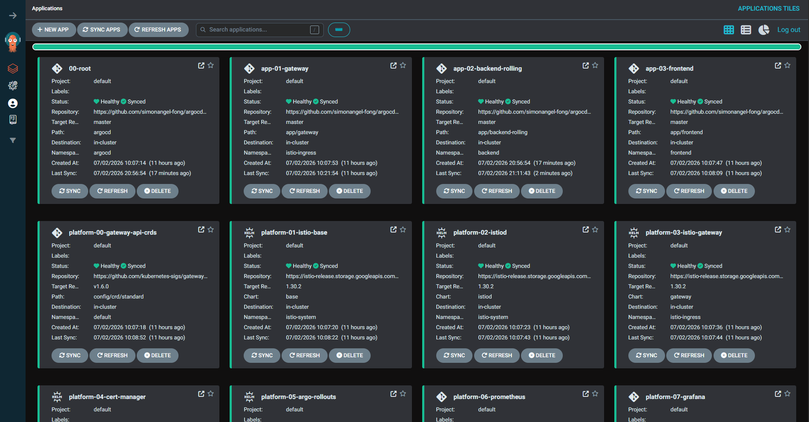
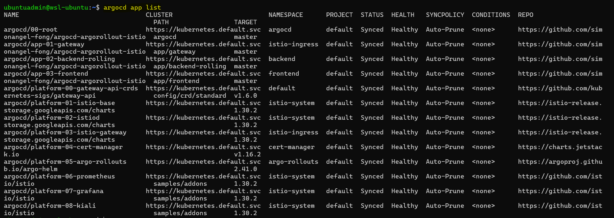

# Kubernetes Deployment Playbook: ArgoCD

[Back](../README.md)

- [Kubernetes Deployment Playbook: ArgoCD](#kubernetes-deployment-playbook-argocd)
  - [Deployment](#deployment)
  - [Sync Waves](#sync-waves)

---

Install Argo CD and use the **app-of-apps** pattern to declaratively deploy the platform (Istio, cert-manager, Argo Rollouts, observability) and the `demo-api` workloads.

## Deployment

```sh
export KUBECONFIG=~/kubeconfig
az aks get-credentials --resource-group rg-general --name k8s-deploy-dev --overwrite-existing -f $KUBECONFIG

# install argocd
helm install argocd argo/argo-cd --namespace argocd --create-namespace

# retrieve initial admin password
kubectl -n argocd get secret argocd-initial-admin-secret \
  -o jsonpath="{.data.password}" | base64 --decode; echo

# port-forward the UI
kubectl port-forward service/argocd-server -n argocd 8080:443

# apply the root app-of-apps
kubectl apply -f argocd/00-root.yaml

# login and verify
argocd login localhost:8080
argocd app list
```





---

## Sync Waves

`argocd.argoproj.io/sync-wave` orders Application sync within a single run: lower waves sync first, and Argo CD waits for each wave to become Healthy before starting the next. This project uses waves to guarantee that CRDs and control planes exist before the resources that depend on them.

| Wave | Applications                                                              | Purpose                                          |
| ---- | ------------------------------------------------------------------------- | ------------------------------------------------ |
| `0`  | `istio-base`                                                              | Install Istio CRDs first.                        |
| `1`  | `istiod`                                                                  | Bring up the Istio control plane.                |
| `2`  | `istio-gateway`, `cert-manager`, `argo-rollouts`, `prometheus`, `grafana` | Platform components that depend on Istio + CRDs. |
| `3`  | `kiali`                                                                   | Observability UI (depends on Prometheus).        |
| `10` | `demo-api` backends                                                       | Application workloads.                           |
| `11` | `frontend`                                                                | UI, depends on backends.                         |
| `12` | `gateway` (VirtualService + Gateway routes)                               | Exposes the app once workloads are Ready.        |

> Waves are relative, not absolute — gaps (e.g. 3 → 10) exist only to leave room for future insertions.
