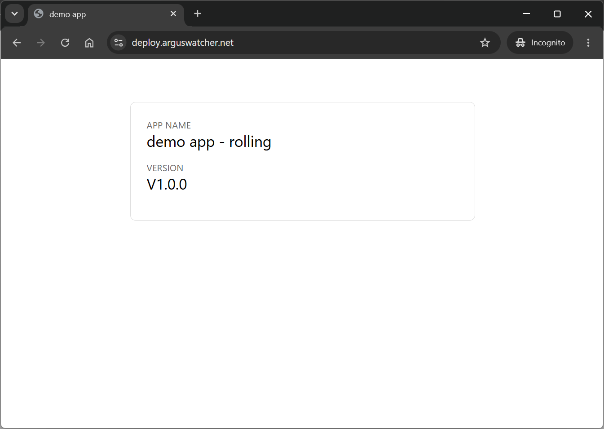

# Kubernetes Deployment Playbook: Network Layer by Istio

[Back](../README.md)

- [Kubernetes Deployment Playbook: Network Layer by Istio](#kubernetes-deployment-playbook-network-layer-by-istio)
    - [Istio Gateway + VirtualService](#istio-gateway--virtualservice)
  - [Sidecar Injection](#sidecar-injection)
  - [Configure and test Gateway](#configure-and-test-gateway)
  - [Network Policy: `AuthorizationPolicy`](#network-policy-authorizationpolicy)
  - [Enable mTLS: `PeerAuthentication`](#enable-mtls-peerauthentication)
  - [TLS via `cert-manager` + `Let's Encrypt`](#tls-via-cert-manager--lets-encrypt)

---

### Istio Gateway + VirtualService

Frontend nginx no longer proxies `/api/` — Istio does the split at the edge:

- `deploy.arguswatcher.net/api/*` → backend
- `deploy.arguswatcher.net/*` → frontend

---

## Sidecar Injection

```sh
# enable sidecar injection
kubectl label ns backend  istio-injection=enabled --overwrite
# namespace/backend labeled

kubectl label ns frontend istio-injection=enabled --overwrite
# namespace/frontend labeled

# restart pods
kubectl rollout restart deploy/backend  -n backend
kubectl rollout restart deploy/frontend -n frontend

# confirm
kubectl get po -n backend  -o wide
# NAME                      READY   STATUS    RESTARTS   AGE   IP             NODE                              NOMINATED NODE   READINESS GATES
# backend-d9fd66d48-5sqrq   2/2     Running   0          7s    10.244.1.157   aks-default-14028782-vmss000000   <none>           <none>
kubectl get po -n frontend -o wide
# NAME                        READY   STATUS    RESTARTS   AGE   IP            NODE                              NOMINATED NODE   READINESS GATES
# frontend-754c4f9787-dvcj8   2/2     Running   0          20s   10.244.1.23   aks-default-14028782-vmss000000   <none>           <none>
```

---

## Configure and test Gateway

- Gateway

```yaml
apiVersion: networking.istio.io/v1
kind: Gateway
metadata:
  name: demo-gateway
spec:
  servers:
    - port:
        number: 80
        name: http
        protocol: HTTP
      hosts:
      tls:
        httpsRedirect: true
    - port:
        number: 443
        name: https
        protocol: HTTPS
      hosts:
      tls:
        mode: SIMPLE
        credentialName: { { .Values.tls.secretName } }
```

```sh
# discover the ingress LB IP
kubectl get svc -n istio-ingress istio-gateway
# NAME            TYPE           CLUSTER-IP     EXTERNAL-IP       PORT(S)                                      AGE
# istio-gateway   LoadBalancer   10.0.118.109   130.107.229.119   15021:32522/TCP,80:31492/TCP,443:31279/TCP   5m11s

# verify
curl -s --resolve deploy.arguswatcher.net:80:130.107.229.119 http://deploy.arguswatcher.net/
# web html
curl -s --resolve deploy.arguswatcher.net:80:130.107.229.119 http://deploy.arguswatcher.net/api/
# {"app":"demo app","version":"V1.0.0"}
curl -s --resolve deploy.arguswatcher.net:80:130.107.229.119 http://deploy.arguswatcher.net/healthz/
# ok
```

---

## Network Policy: `AuthorizationPolicy`

Locks down `backend` and `frontend` at L7 (Envoy):

- `AuthorizationPolicy`:
  - `ALLOW`: only requests from the ingress gateway
  - `SPIFFE`: permit `cluster.local/ns/istio-ingress/sa/istio-gateway`

```sh
# verify
curl -s --resolve deploy.arguswatcher.net:80:130.107.229.119 http://deploy.arguswatcher.net/
# web html
curl -s --resolve deploy.arguswatcher.net:80:130.107.229.119 http://deploy.arguswatcher.net/api/
# {"app":"demo app","version":"V1.0.0"}
curl -s --resolve deploy.arguswatcher.net:80:130.107.229.119 http://deploy.arguswatcher.net/healthz/
# ok

# negative: in-cluster call from a random pod should be denied
kubectl run -n default --rm -it debug --image=curlimages/curl --restart=Never -- curl -sv http://backend.backend.svc.cluster.local/api/
# * Host backend.backend.svc.cluster.local:80 was resolved.
# * IPv6: (none)
# * IPv4: 10.0.190.94
# *   Trying 10.0.190.94:80...
# * Established connection to backend.backend.svc.cluster.local (10.0.190.94 port 80) from 10.244.0.18 port 54590
# * using HTTP/1.x
# > GET /api/ HTTP/1.1
# > Host: backend.backend.svc.cluster.local
# > User-Agent: curl/8.21.0
# > Accept: */*
# >
# * Request completely sent off
# * Recv failure: Connection reset by peer
# * closing connection #0
# pod "debug" deleted from default namespace
# pod default/debug terminated (Error)

# check what got applied
kubectl get authorizationpolicy,peerauthentication -A
# NAMESPACE   NAME                                             ACTION   AGE
# backend     authorizationpolicy.security.istio.io/backend    ALLOW    2m1s
# frontend    authorizationpolicy.security.istio.io/frontend   ALLOW    2m16s

# NAMESPACE   NAME                                           MODE     AGE
# backend     peerauthentication.security.istio.io/default   STRICT   2m1s
# frontend    peerauthentication.security.istio.io/default   STRICT   2m16s
```

---

## Enable mTLS: `PeerAuthentication`

- `PeerAuthentication`
  - `STRICT`: non-mTLS connections rejected.

- Anything else → **403 RBAC: access denied**.

---

## TLS via `cert-manager` + `Let's Encrypt`

- Verify ownership by `DNS01` challenge
- Create `ClusterIssuer`
  - `Cloudflare` Token + `Let's Encrypt` Server
- Create `Certificate`
  - create `Cloudflare A record`, mapping record to IP: `kubectl get svc -n istio-ingress istio-gateway`
  - create secret: `kubectl -n cert-manager create secret generic cloudflare-api-token --from-literal=api-token='<TOKEN>'`
- Gateway:
  - `tls.httpsRedirect: true`

```sh
# confirm certificate
kubectl -n istio-ingress get certificate
# NAME        READY   SECRET       AGE
# demo-cert   True    deploy-tls   25s

kubectl -n istio-ingress get order
# NAME                     STATE   AGE
# demo-cert-1-1201275883   valid   12h

# confirm DNS
curl -k -s https://deploy.arguswatcher.net/api/
# {"app":"demo app","version":"V1.0.0"}
curl -k -s https://deploy.arguswatcher.net/
# html

```


