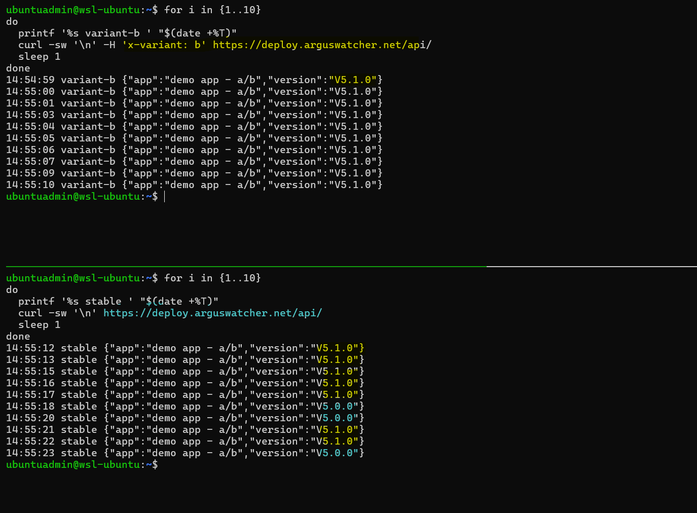

# Deployment - A/B Test

[Back](../README.md)

- [Deployment - A/B Test](#deployment---ab-test)
  - [Preparation](#preparation)
  - [Rollout](#rollout)

---

## Preparation

```sh
helm lint app/backend-ab
# ==> Linting app/backend-ab
# [INFO] Chart.yaml: icon is recommended

# 1 chart(s) linted, 0 chart(s) failed

# Visualization
# argocd
kubectl -n argocd port-forward svc/argocd-server 8080:443
# argo rollouts
kubectl -n argo-rollouts port-forward svc/argo-rollouts-dashboard 31000:3100
# kiali
kubectl -n istio-system port-forward svc/kiali 20001:20001
# grafana
kubectl -n istio-system port-forward svc/grafana 3000:3000
```

---

## Rollout

```sh
# promote
kubectl argo rollouts promote backend-ab -n backend

# sync app
argocd app sync app-02-backend-ab

# variant-b request
for i in {1..10}
do
  printf '%s variant-b ' "$(date +%T)"
  curl -sw '\n' -H 'x-variant: b' https://deploy.arguswatcher.net/api/
  sleep 1
done

# constant traffic
for i in {1..10}
do
  printf '%s stable ' "$(date +%T)"
  curl -sw '\n' https://deploy.arguswatcher.net/api/
  sleep 1
done

# testing completed
kubectl argo rollouts undo backend-ab -n backend
# rollout 'backend-ab' undo

```





