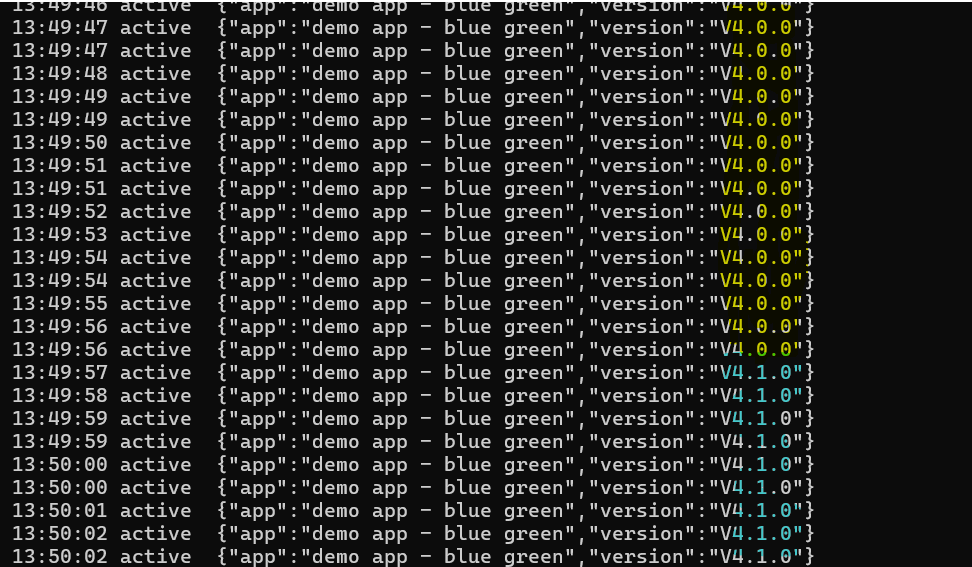

# Deployment - Blue-Green

[Back](../README.md)

- [Deployment - Blue-Green](#deployment---blue-green)
  - [Preparation](#preparation)
  - [Rollout](#rollout)

---

## Preparation

```sh
helm lint app/backend-blue-green
# ==> Linting app/backend-blue-green
# [INFO] Chart.yaml: icon is recommended

# 1 chart(s) linted, 0 chart(s) failed

# Visualization
# argocd
kubectl -n argocd port-forward svc/argocd-server 8080:443
# argo rollouts
kubectl -n argo-rollouts port-forward svc/argo-rollouts-dashboard 31000:3100
# kiali
kubectl -n istio-system port-forward svc/kiali 20001:20001
# grafana
kubectl -n istio-system port-forward svc/grafana 3000:3000
```

---

## Rollout

```sh
# sync app
argocd app sync app-02-backend-blue-green

# confirm pod transitions
kubectl get po -n backend -l app.kubernetes.io/name=backend-backend-blue-green -w

# Preview lane serves the new version
curl -sw '\n' -H 'x-preview: true' https://deploy.arguswatcher.net/api/
# {"app":"demo app - blue green","version":"V4.1.0"}


# Active lane still serves the old version:
curl -sw '\n' https://deploy.arguswatcher.net/api/
# {"app":"demo app - blue green","version":"V4.0.0"}

# When happy, flip production traffic to the new ReplicaSet:
kubectl argo rollouts promote backend-backend-blue-green -n backend


# Active lane still serves the old version:
while true; do
  printf '%s active  ' "$(date +%T)"
  curl -sw '\n' https://deploy.arguswatcher.net/api/
  sleep 0.5
done
# 13:49:53 active  {"app":"demo app - blue green","version":"V4.0.0"}
# 13:49:54 active  {"app":"demo app - blue green","version":"V4.0.0"}
# 13:49:54 active  {"app":"demo app - blue green","version":"V4.0.0"}
# 13:49:55 active  {"app":"demo app - blue green","version":"V4.0.0"}
# 13:49:56 active  {"app":"demo app - blue green","version":"V4.0.0"}
# 13:49:56 active  {"app":"demo app - blue green","version":"V4.0.0"}
# 13:49:57 active  {"app":"demo app - blue green","version":"V4.1.0"}
# 13:49:58 active  {"app":"demo app - blue green","version":"V4.1.0"}
# 13:49:59 active  {"app":"demo app - blue green","version":"V4.1.0"}
# 13:49:59 active  {"app":"demo app - blue green","version":"V4.1.0"}

# roll back
kubectl argo rollouts undo backend-backend-blue-green -n backend
```



