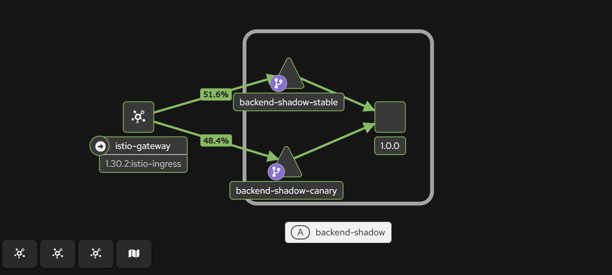

# Deployment - Shadow

[Back](../README.md)

- [Deployment - Shadow](#deployment---shadow)
  - [Preparation](#preparation)
  - [Rollout](#rollout)

---

## Preparation

```sh
helm lint app/backend-shadow
# ==> Linting app/backend-shadow
# [INFO] Chart.yaml: icon is recommended

# 1 chart(s) linted, 0 chart(s) failed

# Visualization
# argocd
kubectl -n argocd port-forward svc/argocd-server 8080:443
# argo rollouts
kubectl -n argo-rollouts port-forward svc/argo-rollouts-dashboard 31000:3100
# kiali
kubectl -n istio-system port-forward svc/kiali 20001:20001
# grafana
kubectl -n istio-system port-forward svc/grafana 3000:3000
```

---

## Rollout

```sh
# sync app
argocd app sync app-02-backend-shadow

# constant traffic
while true; do
  printf '%s ' "$(date +%T)"
  curl -s https://deploy.arguswatcher.net/api/
  echo
  sleep 0.5
done

# get shadow pod log: confirm request
kubectl -n backend logs -f -l app.kubernetes.io/name=backend-shadow,rollouts-pod-template-hash=<CANARY_HASH> --prefix=true --tail=0 | grep api
# [pod/backend-shadow-f68675bcd-x87hb/backend-shadow] 127.0.0.6 - - [03/Jul/2026:20:13:53 +0000] "GET /api/ HTTP/1.1" 200 46 "-" "curl/8.5.0" "99.243.74.50,10.10.0.5,10.244.0.119"
# [pod/backend-shadow-f68675bcd-x87hb/backend-shadow] {"time":"2026-07-03T20:13:53+00:00","ver":"V6.1.0","method":"GET","uri":"/api/","status":200,"xff":"99.243.74.50,10.10.0.5,10.244.0.119","ua":"curl/8.5.0"}
# [pod/backend-shadow-f68675bcd-x87hb/backend-shadow] 127.0.0.6 - - [03/Jul/2026:20:13:54 +0000] "GET /api/ HTTP/1.1" 200 46 "-" "curl/8.5.0" "99.243.74.50,10.10.0.5,10.244.0.119"
# [pod/backend-shadow-f68675bcd-x87hb/backend-shadow] {"time":"2026-07-03T20:13:54+00:00","ver":"V6.1.0","method":"GET","uri":"/api/","status":200,"xff":"99.243.74.50,10.10.0.5,10.244.0.119","ua":"curl/8.5.0"}
# [pod/backend-shadow-f68675bcd-d5lv7/backend-shadow] 127.0.0.6 - - [03/Jul/2026:20:13:54 +0000] "GET /api/ HTTP/1.1" 200 46 "-" "curl/8.5.0" "99.243.74.50,10.10.0.4,10.244.0.119"

# When satisfied, promote to advance past the manual gate
kubectl argo rollouts promote backend-shadow -n backend
# rollout 'backend-shadow' promoted

# Full promote or rollback
kubectl argo rollouts promote backend-shadow -n backend    # or `undo`

```



